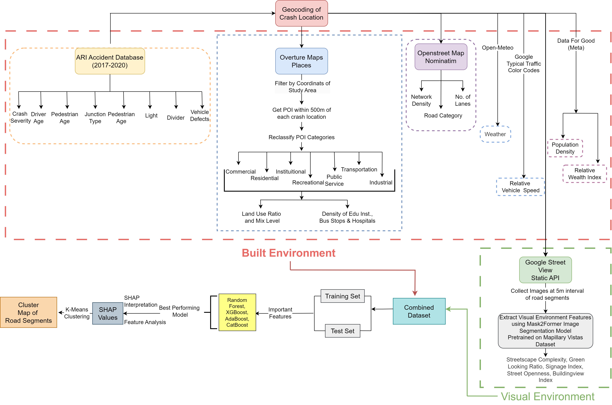

# Pedestrian Crash Severity Prediction using Visual and Built Environment Data

## 🔍 Overview

This repository presents a data-driven framework for predicting pedestrian crash severity by integrating **built-environment features** and **visual streetscape characteristics** using publicly available geospatial data.

The project demonstrates how multimodal data sources can be leveraged to analyze urban safety in **data-scarce environments**, where traditional roadway inventory data is unavailable.

------

## 🚀 Key Contributions

+ Integration of **visual (street-level imagery)** and **built-environment features** into a unified modeling framework
+ Development of a **scalable geospatial data pipeline** using open datasets (Overture Maps, OpenStreetMap, Google Street View)
+ Application of **interpretable machine learning (SHAP)** for both global and local explanations
+ Identification of **spatially heterogeneous crash risk patterns** using clustering on SHAP values

------

## ⚙️ Pipeline Overview



The framework follows a multi-stage pipeline:

1. Crash Data Processing
2. Road Network Extraction (OSMnx)
3. Street View Image Collection
4. Semantic Segmentation (Detectron2 + Mask2Former)
5. Visual Feature Extraction
6. POI-based Land Use Modeling (TF-IDF weighted)
7. Network & Environmental Feature Engineering
8. Feature Integration
9. Machine Learning Modeling
10. SHAP-based Interpretability
11. Clustering for Urban Pattern Discovery

------

## 🗂️ Repository Structure

```id="skpfxh"
crash-built-visual-ml/
│
├── data/               # Sample datasets (raw data excluded)
├── pipeline/           # Data collection and feature engineering
├── models/             # ML model training
├── interpretability/   # SHAP analysis and clustering
├── notebooks/          # EDA and visualization
├── results/            # Figures and tables
└── paper/              # Manuscript
```

------

## 🌍 Data Sources

+ Crash Data (Dhaka police reports/ Accident Research Institiute (ARI))
+ Overture Maps (POI dataset)
+ OpenStreetMap (road network)
+ Google Street View (imagery)
+ Meta Data for Good (demographics / Population Density / Relative Wealth Index)
+ Open-Meteo API (weather data)

------

## 🧠 Feature Engineering

### Built Environment Features

+ Land-use ratios (TF-IDF weighted POI categories)
+ Network density
+ Lane count
+ Population density
+ Facility density (schools, hospitals, bus stops)

### Visual Features (from segmentation)

+ Green View Index 🌳
+ Street Openness 🌤️
+ Building View Index 🏢
+ Signage Index 🚧
+ Streetscape Complexit


------

## 🤖 Modeling

We evaluate multiple ensemble models:

+ Random Forest
+ AdaBoost
+ CatBoost
+ **XGBoost (Best Performing)**

**Best Performance:**

+ F1 Score: 0.79
+ Accuracy: 0.72
+ AUC: 0.70

------

## 🔎 Interpretability

We use SHAP (SHapley Additive Explanations) to:

+ Identify globally important features
+ Explain individual predictions
+ Analyze nonlinear feature relationships
+ Cluster road segments based on feature contributions

------

## 📊 Key Findings


+ Visual + built-environment features jointly influence crash severity
+ Streetscape complexity shows nonlinear effects
+ Strong spatial heterogeneity across urban road segments
+ Context-aware interventions outperform uniform policies

------

## 🛠️ How to Run

### 1. Clone the repository

```id="vjx3l9"
git clone git@github.com:USERNAME/multimodal-crash-severity-prediction.git
cd multimodal-crash-severity-prediction
```

### 2. Install dependencies

```id="9mkrtg"
pip install -r requirements.txt
```

### 3. Configure environment

```id="bzr3tg"
export GOOGLE_API_KEY=your_key
```

### 4. Run full pipeline

```id="1yq0tn"
python pipeline/run_full_pipeline.py
```


------

## 📄 Paper

*Assessing the Visual and Built Environment Risk on Pedestrian-Vehicle Crash Severity using Open Geospatial Data*
Status:  in preparation

------

## 📜 License

MIT License


------